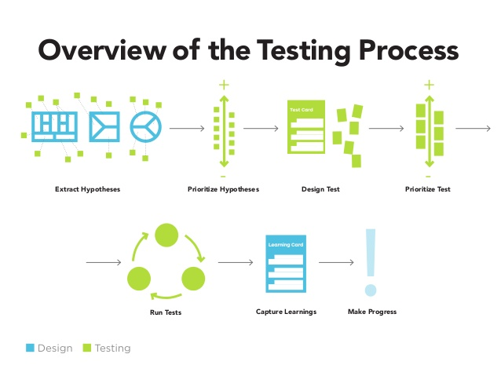
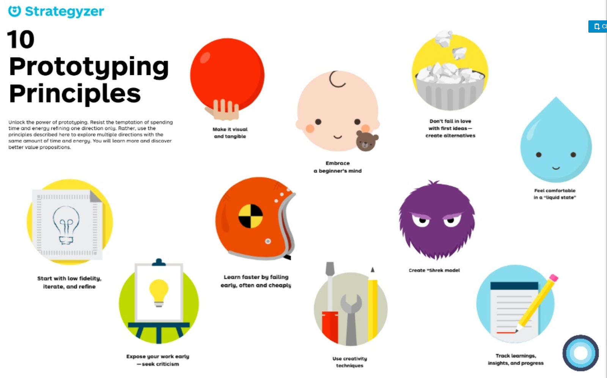

### **Week 3: Start testing and validating your ideas**

_You now have a better understanding of your project’s value proposition and scope of your participation in this program. Taking into account the stage your project is in, you will formulate ideas and concrete tests that will help you make decisions for advancing your project._

_E.g. if your project has already considerable user validation, and has a prototype, you may want to focus your tests on documentation, raising funds or community building. Also, you may detect it’s necessary to learn about specific tools such as freeCAD, KiCAD, etc. You can ask your mentor for resources or check our collaborative resources list._

**Goal of the week:** Learn to design and frame experiments to validate key hypothesis in your project

>>>>>  gd2md-html alert: inline image link here (to images/Open-Hardware0.png). Store image on your image server and adjust path/filename if necessary.  (<a href="#">Back to top</a>)(<a href="#gdcalert2">Next alert</a>) >>>>> 

**Assignments:**

*   Extract 6 key hypothesis/assumptions that are related to your core value proposition
*   Design experiments (tasks) that tackle those specific hypotheses, goals, targets
*   Consider which resources do you need to achieve them. Which resources do you already have at hand? How can your mentor help you in getting those resources you need?
*   Open issues that describe the experiments you designed and use the project board in GitHub to reflect which actions you will take.
*   If you have new hypothesis and ideas update your canvas. What would you do to validate these ideas, what experiments would you design?

**_Hint: The first basic validation should be researching on how other people address the problems you are trying to tackle. We don’t want to reinvent the wheel!_**

>>>>>  gd2md-html alert: inline image link here (to images/Open-Hardware1.png). Store image on your image server and adjust path/filename if necessary.  (<a href="#">Back to top</a>)(<a href="#gdcalert3">Next alert</a>) >>>>> 

<table>
  <tr>
   <td><strong>Tools</strong>
   </td>
   <td><strong>Use it for</strong>
   </td>
   <td><strong>Examples & tutorials</strong>
   </td>
  </tr>
  <tr>
   <td><a href="https://assets.strategyzer.com/assets/resources/the-test-card.pdf">Test card</a>
   </td>
   <td>Designing an experiment
   </td>
   <td><a href="https://www.youtube.com/watch?v=cW46ySJmLD8">Validate your idea with test cards</a>
   </td>
  </tr>
  <tr>
   <td><a href="https://strategyzr.s3.amazonaws.com/assets/vpd/resources/the-learning-card.pdf">Learning card</a>
   </td>
   <td>Use it to capture key learnings and new ideas based on those learnings
   </td>
   <td><a href="https://www.youtube.com/watch?v=U1FlRmg7j-o">Capture your learnings with learning cards</a>
   </td>
  </tr>
  <tr>
   <td>Github issues
   </td>
   <td>Write down your experiment/build as an issue with clear goal, Use github tags to categorize your issues
   </td>
   <td><a href="https://guides.github.com/features/issues/">Mastering issues with github</a>

<a href="https://www.youtube.com/watch?v=YshvUGgF_3o">Github issues and labels</a>
   </td>
  </tr>
  <tr>
   <td>Github Project board
   </td>
   <td>Use it to prioritize the tests you want to run and also to assign it to participants
   </td>
   <td><a href="https://www.youtube.com/watch?v=ff5cBkPg-bQ">Github Project Management</a>

<a href="https://help.github.com/en/github/managing-your-work-on-github/about-project-boards">About project boards</a>
   </td>
  </tr>
  <tr>
   <td>Draw with pencil and paper (keep it simple)
   </td>
   <td>Visualizing making your ideas more tangible
   </td>
   <td><a href="https://www.youtube.com/watch?v=TTu-HmzWOX8">Why is Sketching so Important?</a>
   </td>
  </tr>
  <tr>
   <td>CAD might come handy for certain projects but is not indispensable at this stage
   </td>
   <td>
   </td>
   <td><a href="https://www.freecadweb.org/wiki/Tutorials">Tutorials - FreeCAD</a>
   </td>
  </tr>
  <tr>
   <td>Physical prototypes
   </td>
   <td>Testing technical assumptions in real life and easily iterate
   </td>
   <td><a href="https://predictabledesigns.com/overview-of-the-various-types-of-hardware-prototypes/">Overview of the Various Types of Hardware Prototypes</a>
   </td>
  </tr>
</table>

---
